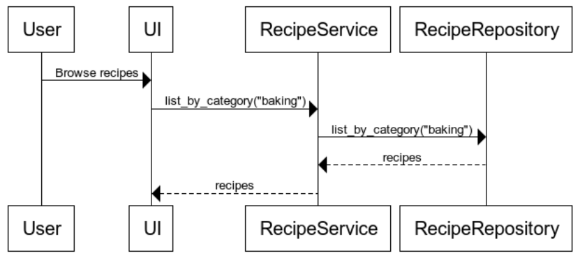

# Arkkitehtuurikuvaus

## Rakenne

Koodin pakkausrakenne on seuraava:

Pakkaus ui sisältää käyttöliittymästä vastaavan koodin.
Services sisältää sovelluslogiikasta ja repositories tiedon pysyväistallennuksesta vastaavan koodin.
Pakkauksessa entities on sovelluksen käyttämiä tietokohteita kuvastavat luokat.

## Käyttöliittymä

Käyttöliittymä sisältää neljä eri näkymää:

- Päävalikko
- Reseptin lisääminen
- Reseptien selaaminen
- Reseptin muuttaminen tai poistaminen

Näkymät on toteutettu omina luokkinaan ja yksi on aina kerrallaan näkyvissä.
UI-luokka vastaa siitä, mikä näkymä on kulloinkin esillä.
Käyttöliittymä kutsuu ainoastaan [RecipeService](https://github.com/annehavunen/ot-harjoitustyo/blob/master/src/services/recipe_service.py)-luokan metodeja,
ja se on pyritty eristämään sovelluslogiikasta.

## Sovelluslogiikka

Sovelluksen looginen malli perustuu luokkiin Recipe ja Category
sekä tietokantatauluun Recipe_category, joka yhdistää reseptit ja kategoriat toisiinsa.

Luokka RecipeService tarjoaa metodit käyttöliittymän vaatimille toiminnoille.
Se välittää myös toiminnot RecipeRepositoryyn.

RecipeRepository tallentaa tietokantatauluihin Recipe, Category ja Recipe_category.
Se myös hakee niistä tietoa.

## Tietojen pysyväistallennus

Luokka RecipeRepository vastaa tietojen tallentamisesta SQLite-tietokantaan.
Käytössä on kolme taulua,
jotka alustetaan [initialize_database.py](https://github.com/annehavunen/ot-harjoitustyo/blob/master/src/initialize_database.py)-tiedostossa.
Reseptit tallennetaan tauluun Recipe sekä resepteihin liittyvät kategoriat tauluun Category.
Reseptien ja kategorioiden id:t saadaan yhteyteen Recipe_category-taulun avulla.

## Päätoiminnallisuudet

### Reseptin luominen

Ensin käyttäjä valitsee luoda uuden reseptin.
Reseptille kirjoitetaan nimi sekä valitaan, mitkä kategoriat reseptiin liittyvät,
ja liittyykö reseptiin verkko-osoite vai itse kirjoitettu ohje.
Esimerkkitapauksessa reseptiin liittyy URL-osoite.
Sovelluksen logiikka etenee seuraavasti:

Käyttöjärjestelmä välittää reseptin nimen ja osoitteen.
RecipeService selvittää, onko saman niminen resepti jo olemassa.
Mikäli ei ole, luo RecipeService uuden reseptin ja RecipeRepository tallentaa sen tietokantaan.
Tämän jälkeen käyttöjärjestelmä antaa reseptin kategoriat RecipeServicelle.
RecipeService luo kategoriat yksi kerrallaan, jonka jälkeen
RecipeRepository tallentaa ne tietokantaan
ja yhdistää reseptin sekä kategorian id:t toisiinsa.

### Reseptien selailu

Kun käyttäjä painaa Browse recipes -painiketta, etenee sovelluslogiikka seuraavasti:

Käyttöliittymä välittää käyttäjän valitseman kategorian RecipeServicelle.
joka välittää sen edelleen RecipeRepositorylle.
RecipeRepository palauttaa kaikkien kyseiseen kategoriaan liitettyjen reseptien nimet.
Mikäli käyttäjä olisi valinnut "show all", palauttaisi RecipeRepository RecipeServicen pyynnöstä kaikki tallennetut reseptit.
RecipeService palauttaa viimein nimet listana käyttöliittymälle, joka tulostaa reseptit.
Näkymässä on myös mahdollista avata joko reseptiin liittyvän verkkosivun tai ohjeen.

### Reseptien muuttaminen

Käyttäjän painettua "Change a recipe" etenee sovelluslogiikka seuraavasti:

Käyttöliittymä pyytää RecipeServiceä hakemaan reseptin id:n RecipeRepositorysta.
Samalla se selvittää, onko varmasti olemassa sen niminen resepti, jota käyttäjä yrittää muuttaa.
Esimerkkikuvassa muutetaan reseptin nimeä.
Käyttöliittymä pyytää reseptin id:tä uudella nimellä ja varmistaa tällä tavalla, ettei saman nimistä reseptiä ole jo olemassa.
Kun kaikki on kunnossa, käyttöliittymä lähettää alkuperäisen id:n ja uuden reseptin nimen RecipeServicelle,
jonka jälkeen RecipeRepository muuttaa nimen uudeksi id:n perusteella.

## Ohjelman rakenteeseen jääneet heikkoudet

### Käyttöliittymä

Graafisen käyttöliittymän koodissa on paikoitellen pitkiä metodeja, joiden toiminnallisuutta voisi jakaa pienempiin osiin.
Käyttöliittymässä on myös jonkin verran toisteisuutta.

Reseptien muuttamisesta vastaavassa näkymä ei toimi ideaalisella tavalla,
mikäli käyttäjä muuttaa monta kertaa saman reseptin nimeä.
