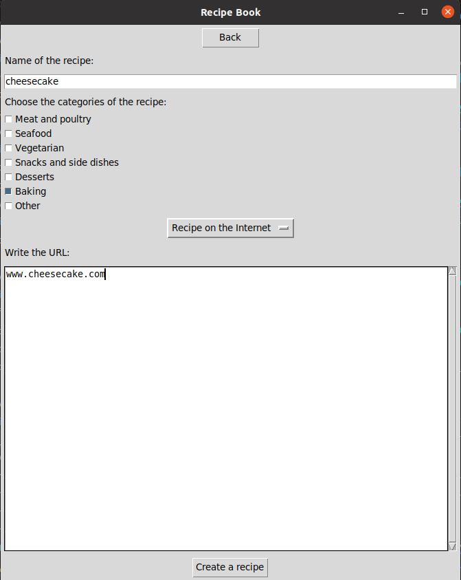
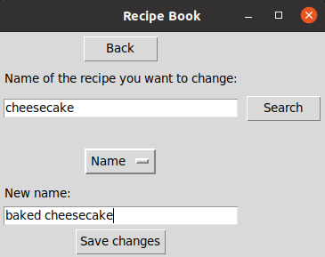

# Käyttöohje

Lataa sovelluksen lähdekoodi valitsemalla viimeisin release
ja sen jälkeen *Assets*-osion alta *Source code*.

## Ohjelman käynnistäminen

Ennen ohjelman käynnistämistä asenna riippuvuudet komennolla:

> poetry install

Tämän jälkeen ohjelman voi käynnistää komennolla:

> poetry run invoke start

## Päänäkymä

Sovellus avautuu päänäkymään:

Käyttäjä voi valita haluamansa toiminnon painiketta painamalla.

## Uuden reseptin luominen

Päänäkymästä voi siirtyä uuden reseptin luomisnäkymään painamalla painiketta "Add a recipe".

Uusi resepti luodaan syöttämällä tiedot valkoisiin syötekenttiin ja painamalla painiketta "Create a recipe".

Takaisin päänäkymään pääsee painamalla painiketta "Back".

## Reseptien selaaminen

Päänäkymästä voi siirtyä reseptien selaamisnäkymään painamalla painiketta "Browse recipes".

Jokainen resepti näkyy niiden kategorioiden alla, mihin käyttäjä on reseptin sijoittanut.
Valikossa on myös vaihtoehto "show all", jolloin käyttäjä näkee kaikki lisäämänsä reseptit kerralla.
Mikäli käyttäjä kirjoittaa reseptin nimen ja painaa "Open", avaa ohjelma URL-osoitteen, jonka käyttäjä on reseptille antanut.

## Reseptien muuttaminen

Päänäkymästä voi siirtyä reseptien muuttamisnäkymään painamalla painiketta "Change a recipe".
Muuttaakseen reseptiä käyttäjän tulee kirjoittaa reseptin nimi ylimpään syötekenttään.
Sen jälkeen hän valitsee valintaruuduista, haluaako hän muuttaa reseptin nimeä tai osoitetta tai poistaa sen kokonaan.
Mikäli kaikki on kunnossa, tallentuvat muutokset painamalla painiketta "Save changes".

