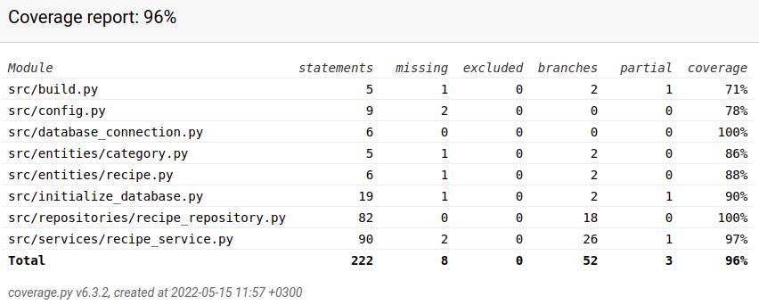

# Testausdokumentti

## Yksikkö- ja integraatiotestaus

Sovelluslogiikasta vastaavan RecipeService-luokan testaaminen tapahtuu [TestRecipeService](https://github.com/annehavunen/ot-harjoitustyo/blob/master/src/tests/recipe_service_test.py)-luokassa.
RecipeRepository vastaa tiedon pysyväistallennuksesta, ja sitä testataan luokassa [TestRecipeRepository](https://github.com/annehavunen/ot-harjoitustyo/blob/master/src/tests/recipe_repository_test.py).
Testaaminen tapahtuu ainoastaan testeihin tarkoitetuilla tiedostoilla,
joiden nimet on konfiguroitu tiedostoon *.env.test*.

Testauksen haarautumakattavuus on 96%. Käyttöliittymäkerros on jätetty testauksesta pois.

## Järjestelmätestaus

Sovellus on haettu ja testattu [käyttöohjeessa](https://github.com/annehavunen/ot-harjoitustyo/blob/master/dokumentaatio/kayttoohje.md) kuvatulla tavalla.

Kaikki [vaatimusmäärittelyssä](https://github.com/annehavunen/ot-harjoitustyo/blob/master/dokumentaatio/vaatimusmaarittely.md)
ja käyttöohjeessa listatut toiminnallisuudet on testattu erilaisilla syötteillä.
Syötekenttiin on annettu myös virheellisiä syötteitä, kuten tyhjiä arvoja.
