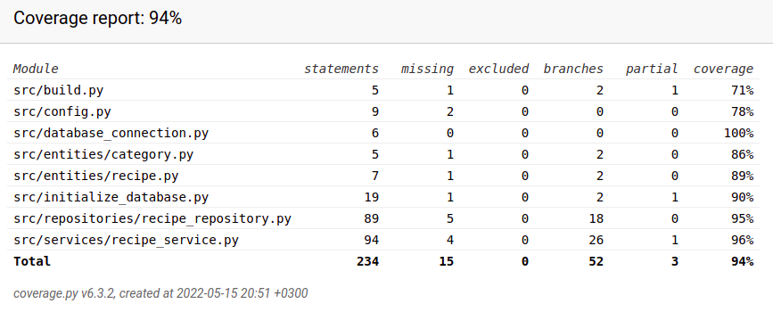

# Testausdokumentti

## Yksikkö- ja integraatiotestaus

Sovelluslogiikasta vastaavan RecipeService-luokan testaaminen tapahtuu TestRecipeService-luokassa.
RecipeRepository vastaa tiedon pysyväistallennuksesta, ja sitä testataan luokassa TestRecipeRepository.
Testaaminen tapahtuu ainoastaan testaamiseen tarkoitetuilla tiedostoilla,
joiden nimet on konfiguroitu tiedostoon *.env.test*.

Testauksen haarautumakattavuus on 96%. Käyttöliittymäkerros on jätetty testauksesta pois.

## Järjestelmätestaus
